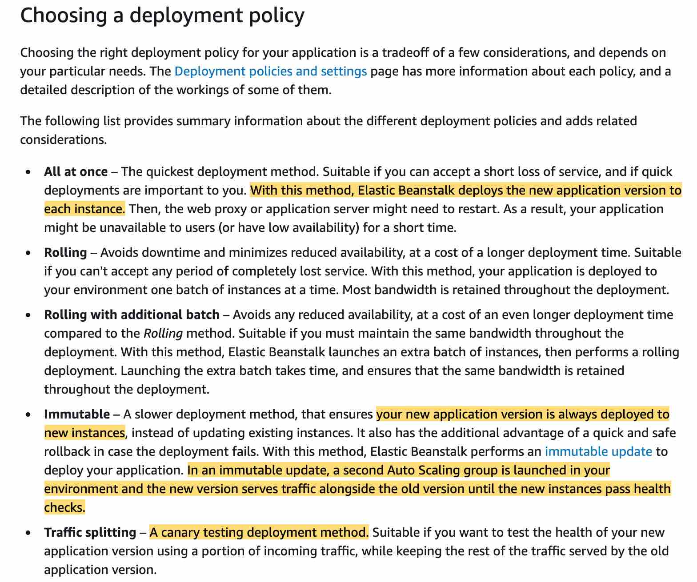
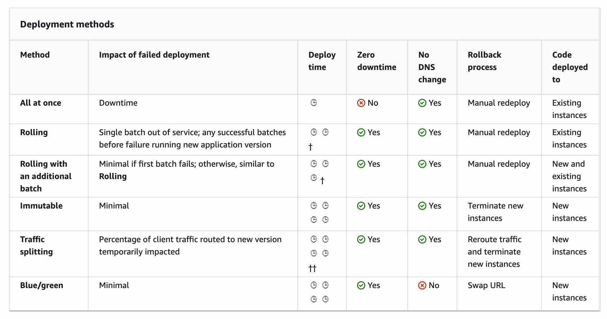

- Support blue/green deployment, by creating a new environment for the updated version, testing it, and then swaping CNAME(DNS Alias) to route a traffic from old to new environment
- To perform a CNAME swap, a custom action is required. CodeDeploy native Elastic beanstalk doesn't automatically handle CNAME swaping for Blue/green, using a lambda function to do it.

## File .ebextensions
- integrate directly to the project for configuration environnement (variables, instance ec2 ...)
When the values is applied in different location, the order of precedence is folowing:
    - Settings applied directly in the environment (API)
    - Saved configuration
    - File .ebextensions
    - Default configuration