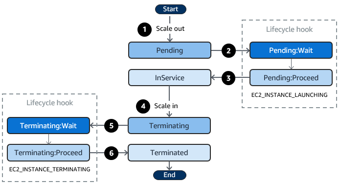

Lifecycle hook 

# Lifecycle hook ASG can trigger some custom action. 
- Can create a eventbridge (trigger lambda, SSM ..) for a action in time waiting
- use a User-Data script for signal ASG pass status to "IN SERVICE"
`
aws autoscaling complete-lifecycle-action --lifecycle-action-result CONTINUE \
  --instance-id $INSTANCE_ID --lifecycle-hook-name $HOOK_NAME \
  --auto-scaling-group-name $ASG_NAME --region us-east-1
`
- Use SNS/SQL with a consumer